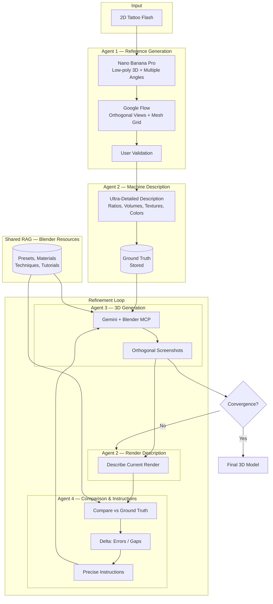
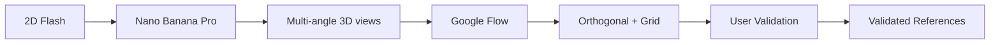
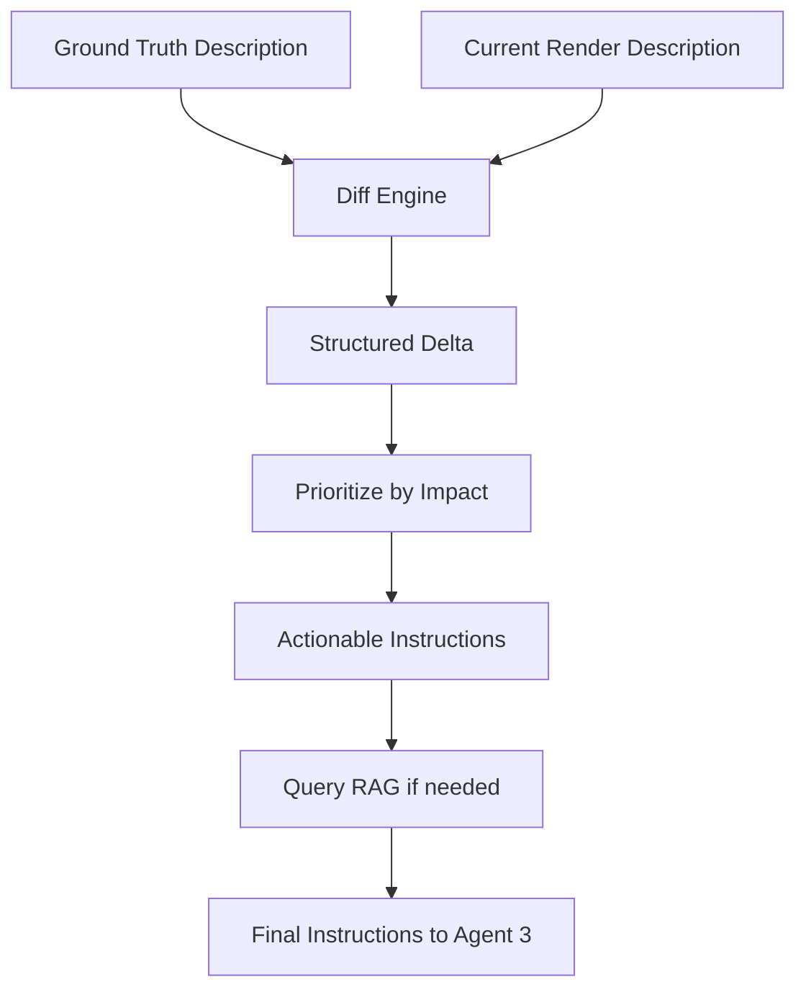
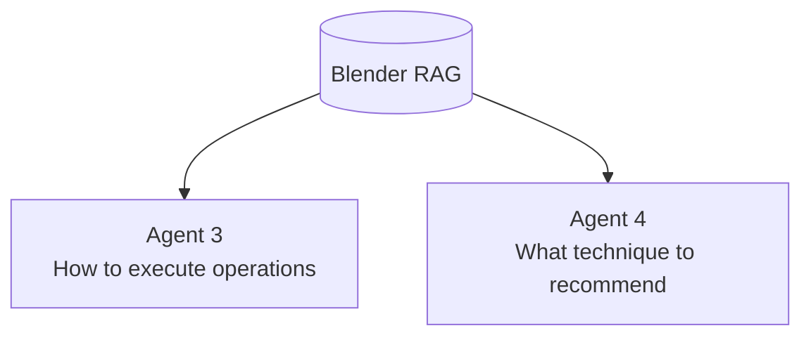
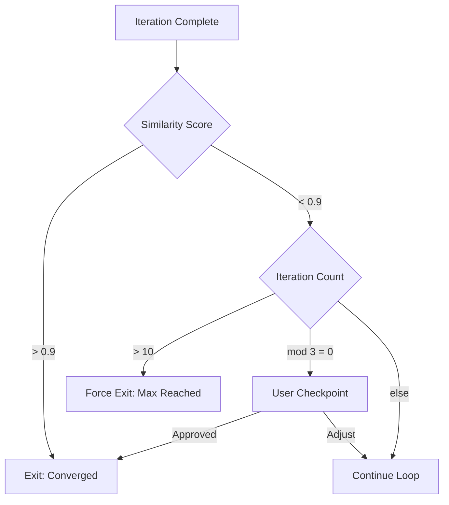
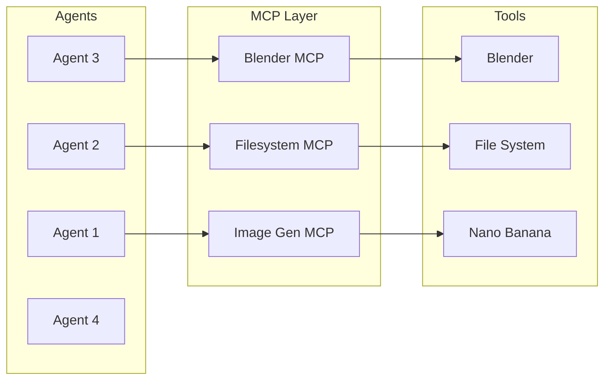

# Blendr Assist

> Multi-Agent Pipeline for 2D Flash to 3D Model Conversion via MCP-Orchestrated Tools

Repo type: **ideas-draft**  
Status: **conceptual + architectural proposal**

---

## TL;DR

Blendr Assist is a multi-agent system that converts **2D tattoo flash designs into 3D models** through an iterative refinement loop. It leverages MCP (Model Context Protocol) to orchestrate external tools (Blender, image generators, 3D generators) as a unified agentic workflow.

The core insight: use **machine-readable descriptions as ground truth** for comparison, not raw images. This enables precise delta computation and actionable correction instructions between iterations.

---

## Motivation

Converting 2D artwork to 3D models is traditionally:
- **Manual**: Artists spend hours modeling from reference
- **Imprecise**: AI-generated 3D often misses proportions, volumes, details
- **Non-iterative**: Most tools are one-shot with no feedback loop

The hypothesis: a **multi-agent feedback loop** comparing structured descriptions (not pixels) can iteratively converge toward an accurate 3D representation.

---

## High-Level Architecture



---

## Phase 1 — Reference Generation (Agent 1)

**Objective**: Generate high-quality 3D references from the 2D flash for downstream description.

| Step | Tool | Output |
|------|------|--------|
| 3D Draft | Nano Banana Pro | Low-poly 3D model + multiple angle views |
| Orthogonal Views | Google Flow | Clean orthogonal projections + mesh grid overlay |
| Validation | User | Approved reference set |



**Why two tools?**
- Nano Banana Pro: Best-in-class for quick 3D interpretation of 2D art
- Google Flow: Standardizes views for consistent downstream comparison

---

## Phase 2 — Ground Truth Description (Agent 2)

**Objective**: Create a machine-readable, ultra-detailed description that serves as the **single source of truth** for all comparisons.

### Description Schema

```json
{
  "global": {
    "overall_shape": "humanoid figure, stylized proportions",
    "height_width_ratio": 2.3,
    "symmetry": "bilateral, slight asymmetry in pose"
  },
  "volumes": {
    "head": { "shape": "spherical", "relative_size": 0.15 },
    "torso": { "shape": "tapered cylinder", "relative_size": 0.35 },
    "limbs": { "shape": "elongated cylinders", "taper": 0.8 }
  },
  "textures": {
    "surface": "smooth with engraved line details",
    "patterns": ["tribal lines on torso", "dot work on shoulders"]
  },
  "colors": {
    "primary": "#1a1a1a",
    "secondary": "#8b0000",
    "distribution": "primary 80%, secondary accents 20%"
  }
}
```

**Critical**: Agent 2 must use the **exact same prompt/config** for describing both references AND renders. This ensures delta computation compares apples to apples.

---

## Phase 3 — 3D Generation Loop (Agent 3)

**Objective**: Iteratively generate and refine 3D model in Blender via MCP.


### Why Gemini + Blender MCP?

| Component | Role |
|-----------|------|
| Gemini | Strong 3D spatial reasoning, interprets instructions visually |
| Blender MCP | Executes precise modeling operations programmatically |

### MCP Operations Available

- Create/modify mesh primitives
- Apply modifiers (subdivision, boolean, mirror)
- Set materials and colors
- Position camera for orthogonal captures
- Export screenshots

---

## Phase 4 — Comparison & Instructions (Agent 4)

**Objective**: Compare ground truth description vs current render description, generate precise correction instructions.



### Delta Structure

```json
{
  "errors": [
    {
      "aspect": "head_size",
      "expected": 0.15,
      "actual": 0.22,
      "severity": "high",
      "instruction": "Reduce head scale by 30% on all axes"
    },
    {
      "aspect": "torso_shape",
      "expected": "tapered cylinder",
      "actual": "uniform cylinder",
      "severity": "medium",
      "instruction": "Apply taper modifier, factor 0.8, along Z axis"
    }
  ],
  "missing": [
    {
      "aspect": "tribal_lines",
      "instruction": "Add curve-based geometry on torso surface following reference pattern"
    }
  ],
  "overall_similarity": 0.67
}
```

### RAG Integration

Agent 4 queries the shared RAG for:
- "How to apply taper modifier in Blender"
- "Best technique for engraved line details"
- "Material setup for metallic black surface"

This enriches instructions with concrete Blender techniques.

---

## Phase 5 — Shared RAG (Agent 5)

**Objective**: Provide Blender-specific knowledge to both generation (Agent 3) and comparison (Agent 4) agents.

### Knowledge Base Contents

| Category | Examples |
|----------|----------|
| Modeling Techniques | Subdivision workflows, boolean operations, sculpting basics |
| Materials & Shaders | PBR setup, procedural textures, node configurations |
| Presets | Common material presets, lighting rigs, camera setups |
| Troubleshooting | Common errors, optimization tips |



---

## Convergence & Exit Criteria

### Hybrid Approach



| Criterion | Threshold | Action |
|-----------|-----------|--------|
| Similarity Score | > 0.9 | Auto-exit, converged |
| Max Iterations | 10 | Force exit, present best result |
| User Checkpoint | Every 3 iterations | Human validation/adjustment |

### Why User Checkpoints?

Some differences are **technically measurable but artistically acceptable**. A human eye catches "close enough" better than a delta score.

---

## Technical Stack

| Component | Technology | Role |
|-----------|------------|------|
| Orchestration | LangGraph | Multi-agent state management, loop control |
| Agent 1 Tools | Nano Banana Pro, Google Flow | Reference generation |
| Agent 2 | Claude / GPT-4V | Structured image description |
| Agent 3 | Gemini + Blender MCP | 3D generation and manipulation |
| Agent 4 | Claude | Comparison and instruction generation |
| RAG | pgvector + Blender docs | Technique retrieval |
| MCP Layer | Blender MCP Server | Bridge between LLM and Blender |

---

## MCP as Integration Pattern

This project demonstrates **MCP as a universal tool integration layer** for multi-agent systems.



**Key insight**: MCP abstracts tool complexity. Agents don't need to know Blender's Python API — they call high-level MCP operations.

### Scalability

Adding a new tool = adding a new MCP server. The orchestration logic stays unchanged.

---

## Questions

1. **Description Schema**: What level of detail in the ground truth description yields best convergence?

2. **Gemini vs Claude for 3D**: Is Gemini actually better at spatial reasoning, or would Claude + detailed instructions match it?

3. **Convergence Speed**: How many iterations on average? Can we predict early if a flash is "hard" to convert?

4. **Style Transfer**: Can this pipeline preserve artistic style, not just geometric accuracy?

5. **Generalization**: Does this work for non-tattoo 2D art (illustrations, logos, concept art)?

---

## Potential Applications

| Domain | Use Case |
|--------|----------|
| Tattoo Artists | Preview flash designs in 3D before inking |
| Game Dev | Quick asset generation from concept art |
| Product Design | 2D sketch to 3D prototype |
| Education | Learn 3D modeling through iterative AI feedback |

---

## Status

This repository is an ideas draft:
- exploratory
- non-production
- open to iteration

*Its purpose is to explore multi-agent orchestration via MCP for creative 3D workflows.*
