# Blendr Assist

> Personal AI Assistant for 2D Tattoo Flash to 3D Printable Model Conversion

**Project Type**: Personal tool for 3D print + hand painting workflow  
**Status**: Conceptual + architectural proposal  
**Goal**: Convert tattoo flash designs into print-ready 3D models for physical creation

---

## TL;DR

Blendr Assist converts your **2D tattoo flash designs into 3D printable models** that you'll paint and assemble by hand. It's not about making beautiful digital renders—it's about creating **physical objects** from your art.

**Pipeline**: Flash → Nano Banana (style) → Zero123-XL (multi-view) → InstantMesh (3D) → Geometry refinement → Print preparation → STL export

**Focus**: Geometry quality, printability, assembly design. Textures/materials are irrelevant—you'll paint them yourself.

---

## Motivation

As a former tattoo artist who creates physical art, you want to:
- **Bring your 2D flash designs into the physical world** as 3D objects
- **Print them yourself** (resin or FDM)
- **Paint them by hand** like you would paint a miniature
- **Assemble multi-part pieces** into finished sculptures

This isn't about digital art or game assets. It's about **making real things you can hold.**

---

## 🎯 Design Principles for 3D Printing

### 1. **Geometry > Everything**

```python
# What matters
priorities = {
    "manifold_geometry": "CRITICAL - no holes, no errors",
    "wall_thickness": "CRITICAL - >= 2mm for strength", 
    "detail_size": "CRITICAL - >= 0.5mm to be visible after print",
    "printability": "CRITICAL - can it actually be printed?"
}

# What doesn't matter
ignored = {
    "textures": "You'll paint by hand",
    "pbr_materials": "Not used in printing",
    "lighting": "Only for visual validation",
    "rendering_quality": "Not the final output"
}
```

### 2. **Physical Constraints are Real**

- **Bed size limits** (typical: 200x200x250mm)
- **Overhang angles** (>45° needs supports)
- **Minimum feature size** (0.4-0.5mm depending on printer)
- **Assembly requirements** (parts need interlocking keys)

### 3. **Iteration with Physical Intent**

You're not making it "look good on screen." You're making it **print successfully** and **paint easily**.

---

## High-Level Architecture

```mermaid
flowchart TB
    FLASH[2D Flash Line Art<br/>Your Original Design]
    
    subgraph Agent1["🎨 Agent 1: Reference Generation"]
        FLASH --> NANO[Nano Banana<br/>30s: 2D Line Art → 2D Stylized]
        NANO --> STYLED[Stylized 2D<br/>Colors, shading, volume hints]
        STYLED --> ZERO[Zero123-XL<br/>2-3min: Multi-View Diffusion]
        ZERO --> VIEWS[16 Coherent Views<br/>True 3D perspectives]
        VIEWS --> INSTANT[InstantMesh<br/>2min: 3D Reconstruction]
        INSTANT --> REF[3D Reference Model<br/>Geometry + textures we'll ignore]
    end
    
    REF --> VALIDATE[🔍 Printability Check]
    
    VALIDATE --> ISSUES{Print-Ready?}
    ISSUES -->|Non-manifold| FIX1[Auto-fix Mesh]
    ISSUES -->|Thin walls| FIX2[Thicken Geometry]
    ISSUES -->|Too large| FIX3[Plan Multi-Part]
    ISSUES -->|OK| LOOP
    FIX1 --> LOOP
    FIX2 --> LOOP
    FIX3 --> LOOP
    
    subgraph LOOP["🔄 Geometry Refinement Loop"]
        CURRENT[Current Geometry]
        
        subgraph Agent4["🔍 Agent 4: Geometry Comparator + RAG"]
            COMPARE[Compare Shapes<br/>Geometry ONLY]
            RAG[(Blender Knowledge<br/>+ Print Prep Techniques)]
            INSTRUCT[Generate Blender Instructions]
            
            COMPARE --> RAG
            RAG --> INSTRUCT
        end
        
        subgraph Agent3["⚙️ Agent 3: Geometry Editor"]
            GEMINI[Gemini + Blender MCP]
            SCULPT[Sculpt/Model Operations<br/>NO textures, just geometry]
            
            GEMINI --> SCULPT
        end
        
        CURRENT --> COMPARE
        REF --> COMPARE
        INSTRUCT --> GEMINI
        SCULPT --> CURRENT
    end
    
    LOOP --> YOU{Geometry Approved?}
    YOU -->|No| FEEDBACK[Your Feedback]
    FEEDBACK --> LOOP
    
    YOU -->|Yes| PREP
    
    subgraph PREP["🖨️ Agent 5: Print Preparation"]
        ORIENT[Optimal Print Orientation]
        SUPPORT[Support Analysis]
        HOLLOW[Hollow Interior<br/>Optional - saves material]
        DRAIN[Drainage Holes<br/>If hollowed]
        SPLIT[Split Multi-Part<br/>If > bed size]
        KEYS[Assembly Keys<br/>If multi-part]
        VALIDATE_FINAL[Final Print Validation]
    end
    
    VALIDATE_FINAL --> EXPORT[📦 Export STL Files<br/>Ready to Slice & Print]
    EXPORT --> REPORT[📋 Print Report<br/>Material, time, assembly guide]
```



---

## Phase 1 – Reference Generation (Agent 1)

**Objective**: Generate a clean 3D reference from your 2D flash that we'll refine into a printable model.

### The Three-Stage Pipeline

```python
class Agent1_ReferenceGeneration:
    """
    Stage 1: Nano Banana - Interpret line art into stylized 2D
    Stage 2: Zero123-XL - Generate multi-view 3D perspectives  
    Stage 3: InstantMesh - Reconstruct clean 3D geometry
    """
    
    def __init__(self):
        self.nano_banana = NanoBananaClient(api_key=YOUR_KEY)
        self.zero123 = load_zero123xl()
        self.instant_mesh = load_instantmesh()
    
    def generate_reference(self, flash_line_art: Image) -> Mesh3D:
        """
        Flash (line art) → 3D reference
        
        Total time: ~5-6 minutes
        Total cost: ~$2.70
        """
        
        # Stage 1: Nano Banana interprets your line art
        print("🎨 Stylizing with Nano Banana...")
        stylized_2d = self.nano_banana.generate(
            image=flash_line_art,
            style="tattoo_3d_preview"
        )
        # Output: JPG with colors, shading, volume suggestions
        # This gives Zero123-XL clear hints about 3D structure
        
        # Stage 2: Zero123-XL generates multi-view 3D
        print("📸 Generating 3D views with Zero123-XL...")
        multi_views = self.zero123.generate_multiview(
            input_image=stylized_2d,  # NOT the original line art!
            num_views=16,
            elevation_range=(-15, 75),
            guidance_scale=7.5
        )
        # Output: 16 coherent views of the same 3D object
        
        # Stage 3: InstantMesh reconstructs clean 3D
        print("🔧 Reconstructing 3D with InstantMesh...")
        mesh_3d = self.instant_mesh.reconstruct(
            multi_view_images=multi_views,
            target_polycount=30000,
            quad_remesh=True,
            generate_pbr=False  # Don't need PBR for printing
        )
        # Output: Clean 3D mesh with quad topology
        
        print("✅ Reference generated!")
        return mesh_3d
```

### Why This Pipeline Works

**Nano Banana** → Solves the "line art is ambiguous" problem
- Line art alone lacks depth cues, colors, shading
- Nano Banana "explains" the 3D intent to Zero123-XL
- $2.50 well spent for better geometry quality

**Zero123-XL** → Multi-view consistency
- Generates 16 views of the SAME 3D object
- Much more coherent than diffusing each view separately
- Critical for InstantMesh reconstruction quality

**InstantMesh** → Clean, printable base geometry
- Quad-dominant topology (easier to edit in Blender)
- Manifold by default (critical for printing)
- Good starting point for refinement

---

## Phase 2 – Geometry Priorities (Agent 2 - Optional)

**Objective**: Define what's important geometrically, NOT texturally.

### Ultra-Light Agent 2

```python
class Agent2_GeometryPriorities:
    """
    NOT a detailed description of every aspect
    JUST your artistic priorities for the GEOMETRY
    """
    
    def extract_priorities(self, reference_3d, your_input):
        """
        You tell the system what matters geometrically
        """
        return {
            "critical_features": [
                "Individual grape spheres must be distinct (>= 2mm separation)",
                "Basket weave engraved (1mm depth minimum)",
                "Pear elongated ratio 1.3:1",
                "Stems >= 1mm thick (printable minimum)"
            ],
            "acceptable_deviations": [
                "Exact polycount (30K ± 20%)",
                "Minor proportion adjustments for printability"
            ],
            "non_negotiables": [
                "All walls >= 2mm thick",
                "No overhangs > 45° if possible", 
                "Detail size >= 0.5mm (printer resolution limit)"
            ],
            "painting_considerations": [
                "Clear boundaries between fruits (2mm gap for masking)",
                "Flat-ish surfaces on bottom for painting ease",
                "No undercuts that prevent reaching with brush"
            ]
        }
```

**Note**: This agent is **optional**. You can skip it and just give feedback directly during refinement.

---

## Phase 3 – Geometry Refinement (Agent 3 + 4)

**Objective**: Iteratively refine the geometry (NOT textures) until it's perfect for printing.

### Agent 4: Geometry Comparator with Print-Focused RAG

```python
class Agent4_GeometryComparator:
    """
    Compares GEOMETRY between reference and current iteration
    Uses RAG with Blender + Print Prep knowledge
    """
    
    def __init__(self):
        self.rag = BlenderPrintKnowledgeRAG()
        self.claude = Claude()
    
    def compare(self, reference_3d, current_3d):
        """
        Compare geometry, not textures/materials
        """
        
        # 1. Render both with neutral material (geometry only)
        ref_renders = self.render_geometry_view(reference_3d)
        cur_renders = self.render_geometry_view(current_3d)
        
        # 2. Geometric metrics
        geo_metrics = {
            "shape_similarity": self.chamfer_distance(reference_3d, current_3d),
            "proportion_match": self.compare_bounding_boxes(reference_3d, current_3d),
            "volume_match": self.compare_volumes(reference_3d, current_3d),
            "detail_preservation": self.compare_detail_depth(reference_3d, current_3d)
        }
        
        # 3. Visual comparison (shapes only)
        visual_analysis = self.claude.analyze_images(
            images=[
                {"ref": ref_renders, "label": "Reference Geometry"},
                {"current": cur_renders, "label": "Current Iteration"}
            ],
            instruction="""
            Compare these 3D geometries. Focus ONLY on shapes and proportions.
            Ignore colors, textures, materials completely.
            
            For each geometric difference:
            1. What's different? (e.g., "grapes too smooth")
            2. Where? (e.g., "right side of basket")
            3. How to fix? (suggest Blender operation)
            
            Remember: This is for 3D PRINTING.
            - All features must be >= 0.5mm to be visible
            - All walls must be >= 2mm thick
            - Prefer simple geometry over complex (easier to print)
            """
        )
        
        # 4. Get relevant techniques from RAG
        for issue in visual_analysis["issues"]:
            techniques = self.rag.get_relevant_techniques(
                problem=issue["description"],
                context="3d_printing_preparation"
            )
            issue["suggested_techniques"] = techniques
        
        return {
            "metrics": geo_metrics,
            "visual_analysis": visual_analysis,
            "overall_similarity": self.compute_score(geo_metrics),
            "print_ready": self.assess_printability(current_3d)
        }
    
    def render_geometry_view(self, model_3d):
        """
        Render geometry with neutral material
        No textures, no fancy lighting
        """
        return blender_mcp.render_multiview(
            model=model_3d,
            viewpoints=8,  # Front, back, sides, corners
            material="clay_white",  # Neutral matcap
            lighting="studio_flat",
            resolution=1024,
            show_wireframe_overlay=True  # See topology
        )
```

### Agent 3: Geometry Editor (Blender MCP)

```python
class Agent3_GeometryEditor:
    """
    Executes geometry modifications via Blender MCP
    SKIPS any texture/material operations
    """
    
    def __init__(self):
        self.blender_mcp = BlenderMCPClient()
        self.gemini = GeminiVisionClient()
    
    def execute_refinement(self, instructions, current_model):
        """
        Execute geometry refinement instructions
        """
        
        # Filter out texture/material operations
        geometry_instructions = [
            instr for instr in instructions
            if not self.is_texture_related(instr)
        ]
        
        for instruction in geometry_instructions:
            print(f"🔧 Executing: {instruction['operation']}")
            
            # Gemini translates to Blender operations
            blender_ops = self.gemini.instruction_to_blender(
                instruction=instruction,
                current_state=current_model,
                constraints={
                    "min_wall_thickness": 2.0,  # mm
                    "min_feature_size": 0.5,  # mm
                    "max_overhang": 45,  # degrees
                    "focus": "geometry_only"  # Critical
                }
            )
            
            # Execute via Blender MCP
            for op in blender_ops:
                result = self.blender_mcp.execute(op)
                
                # Validate after each operation
                if not self.is_valid_for_print(result):
                    print("⚠️ Operation created print issues, reverting...")
                    self.blender_mcp.undo()
        
        return self.blender_mcp.get_current_mesh()
    
    def is_texture_related(self, instruction):
        """Check if instruction is about textures/materials"""
        texture_keywords = [
            "texture", "material", "shader", "uv", "color",
            "roughness", "metallic", "normal map", "pbr"
        ]
        return any(kw in instruction.lower() for kw in texture_keywords)
    
    def is_valid_for_print(self, model):
        """Quick validation for printability"""
        return (
            self.blender_mcp.is_manifold(model) and
            self.blender_mcp.min_wall_thickness(model) >= 2.0 and
            self.blender_mcp.is_watertight(model)
        )
```

### Example Refinement Iteration

```python
# Iteration 1
you: "The grapes need to be more defined individually"

agent4_analysis = {
    "issue": "Grapes appear as fused blob, not individual spheres",
    "severity": "high",
    "location": "right side of basket",
    "rag_techniques": [
        "Use Array modifier with sphere primitive",
        "Boolean operations to separate",
        "Sculpt with Clay Strips brush for definition"
    ]
}

agent3_execution = [
    "Select grapes mesh",
    "Enter sculpt mode",
    "Use Clay Strips brush, 0.5mm detail",
    "Define boundaries between individual grapes (2mm separation)",
    "Validate: Each grape is distinct sphere with >= 2mm walls"
]

result: ✅ Individual grapes now visible, 2.3mm spacing

# Iteration 2
you: "Basket weave needs sharper definition"

agent4_analysis = {
    "issue": "Basket pattern too smooth, detail lost",
    "severity": "medium",
    "rag_techniques": [
        "Displacement modifier with weave texture",
        "Sculpt with Draw Sharp brush",
        "Boolean subtract with pattern mesh"
    ]
}

agent3_execution = [
    "Select basket mesh",
    "Add Displacement modifier",
    "Use procedural weave texture, 1.2mm depth",
    "Apply modifier to geometry",
    "Validate: Pattern visible, walls still >= 2mm"
]

result: ✅ Sharp weave pattern, 1.3mm depth, walls 2.4mm
```

---

## Phase 4 – Print Preparation (Agent 5) **NEW & CRITICAL**

**Objective**: Transform the refined geometry into print-ready STL files with assembly instructions.

### Agent 5: Print Preparation Pipeline

```python
class Agent5_PrintPreparation:
    """
    THE MOST IMPORTANT AGENT FOR YOUR USE CASE
    
    Takes refined geometry and makes it actually printable
    """
    
    def __init__(self):
        self.blender_mcp = BlenderMCPClient()
        self.mesh_validator = MeshRepair()
    
    def prepare_for_print(self, refined_model, print_specs):
        """
        Complete print preparation workflow
        
        print_specs = {
            "printer_type": "resin" | "fdm",
            "bed_size": [200, 200, 250],  # mm
            "target_height": 120,  # mm
            "min_wall_thickness": 2.0,  # mm
            "hollow": True,  # Save material
            "resin_drainage": True  # If resin + hollow
        }
        """
        
        print("🔍 Step 1: Validating mesh integrity...")
        validated = self.validate_and_fix_mesh(refined_model)
        
        print("📏 Step 2: Scaling to real-world dimensions...")
        scaled = self.scale_to_target_size(
            validated,
            target_height=print_specs["target_height"]
        )
        
        print("✂️ Step 3: Checking if multi-part needed...")
        if self.exceeds_bed_size(scaled, print_specs["bed_size"]):
            parts = self.split_into_parts(scaled, print_specs["bed_size"])
        else:
            parts = [scaled]
        
        print(f"🔧 Step 4: Preparing {len(parts)} part(s)...")
        prepared_parts = []
        
        for i, part in enumerate(parts):
            print(f"   Part {i+1}/{len(parts)}:")
            
            # 4a. Check and fix wall thickness
            print("   - Validating wall thickness...")
            part = self.ensure_min_wall_thickness(
                part, 
                min_thickness=print_specs["min_wall_thickness"]
            )
            
            # 4b. Optimize orientation for printing
            print("   - Finding optimal print orientation...")
            part, orientation_report = self.optimize_print_orientation(part)
            
            # 4c. Hollow if requested (saves material)
            if print_specs["hollow"]:
                print("   - Hollowing interior...")
                part = self.hollow_model(
                    part,
                    wall_thickness=print_specs["min_wall_thickness"]
                )
                
                # 4d. Add drainage holes (critical for resin)
                if print_specs["resin_drainage"]:
                    print("   - Adding drainage holes...")
                    part = self.add_drainage_holes(part)
            
            # 4e. Add assembly features if multi-part
            if len(parts) > 1:
                print("   - Adding assembly keys...")
                part = self.add_assembly_connectors(part, part_id=i)
            
            prepared_parts.append({
                "model": part,
                "orientation": orientation_report,
                "part_id": i
            })
        
        print("📊 Step 5: Generating print report...")
        report = self.generate_print_report(prepared_parts, print_specs)
        
        print("💾 Step 6: Exporting STL files...")
        exported_files = self.export_stl_files(prepared_parts)
        
        return {
            "parts": prepared_parts,
            "stl_files": exported_files,
            "report": report,
            "ready_to_slice": True
        }
    
    def validate_and_fix_mesh(self, model):
        """
        Fix common mesh issues that prevent printing
        """
        issues_found = []
        
        # Check 1: Non-manifold geometry
        if not self.blender_mcp.is_manifold(model):
            print("   ⚠️ Non-manifold geometry detected, fixing...")
            model = self.blender_mcp.make_manifold(model)
            issues_found.append("non_manifold_fixed")
        
        # Check 2: Watertight (no holes)
        if not self.blender_mcp.is_watertight(model):
            print("   ⚠️ Mesh not watertight, filling holes...")
            model = self.blender_mcp.fill_holes(model)
            issues_found.append("holes_filled")
        
        # Check 3: Flipped normals
        flipped_faces = self.blender_mcp.find_flipped_normals(model)
        if flipped_faces:
            print(f"   ⚠️ {len(flipped_faces)} flipped normals, fixing...")
            model = self.blender_mcp.recalculate_normals(model)
            issues_found.append("normals_fixed")
        
        # Check 4: Duplicate vertices
        duplicates = self.blender_mcp.find_duplicate_vertices(model)
        if duplicates:
            print(f"   ⚠️ {duplicates} duplicate vertices, merging...")
            model = self.blender_mcp.merge_by_distance(model, threshold=0.001)
            issues_found.append("duplicates_merged")
        
        if issues_found:
            print(f"   ✅ Fixed: {', '.join(issues_found)}")
        else:
            print("   ✅ Mesh is clean!")
        
        return model
    
    def split_into_parts(self, model, bed_size):
        """
        Split model into printable parts with assembly keys
        """
        # Analyze model dimensions
        bbox = self.blender_mcp.get_bounding_box(model)
        
        # Find optimal cut planes
        cut_planes = self.find_optimal_cuts(
            bbox=bbox,
            max_part_size=bed_size,
            prefer_natural_seams=True  # Cut at natural boundaries
        )
        
        parts = []
        for i, plane in enumerate(cut_planes):
            # Cut along plane
            part = self.blender_mcp.boolean_split(model, plane)
            
            # Add male/female connectors for assembly
            if i > 0:  # Not the first part
                part = self.add_male_connector(part, plane, key_id=i)
            if i < len(cut_planes) - 1:  # Not the last part
                part = self.add_female_connector(part, plane, key_id=i+1)
            
            parts.append(part)
        
        print(f"   Split into {len(parts)} parts")
        return parts
    
    def add_assembly_connectors(self, part, part_id):
        """
        Add interlocking keys for multi-part assembly
        
        Common designs:
        - Cylindrical pins + holes
        - Dovetail joints
        - Puzzle-piece connectors
        """
        # Example: Cylindrical pin system
        connector_specs = {
            "pin_diameter": 3.0,  # mm
            "pin_length": 5.0,  # mm
            "hole_diameter": 3.1,  # mm (0.1mm tolerance)
            "hole_depth": 5.5  # mm (extra clearance)
        }
        
        # Add pins to one side, holes to other
        if part_id % 2 == 0:  # Even parts get pins
            part = self.blender_mcp.add_cylindrical_pins(
                part,
                diameter=connector_specs["pin_diameter"],
                length=connector_specs["pin_length"],
                count=2  # Two pins for stability
            )
        else:  # Odd parts get holes
            part = self.blender_mcp.add_cylindrical_holes(
                part,
                diameter=connector_specs["hole_diameter"],
                depth=connector_specs["hole_depth"],
                count=2
            )
        
        return part
    
    def optimize_print_orientation(self, model):
        """
        Find optimal orientation to minimize supports and print time
        
        Considers:
        - Minimize overhangs > 45°
        - Maximize flat base contact
        - Balance print time vs support material
        """
        orientations = []
        
        # Test 24 different orientations (every 15° around each axis)
        for rot_x in range(0, 360, 15):
            for rot_z in range(0, 360, 15):
                rotated = self.blender_mcp.rotate(model, (rot_x, 0, rot_z))
                
                score = self.score_orientation(rotated)
                orientations.append({
                    "rotation": (rot_x, 0, rot_z),
                    "score": score,
                    "overhangs": score["overhang_area"],
                    "support_volume": score["estimated_supports"]
                })
        
        # Pick best orientation
        best = max(orientations, key=lambda x: x["score"]["total"])
        
        # Apply optimal rotation
        optimized_model = self.blender_mcp.rotate(model, best["rotation"])
        
        report = {
            "rotation_applied": best["rotation"],
            "overhang_area": best["overhangs"],
            "estimated_support_volume": best["support_volume"],
            "reasoning": self.explain_orientation_choice(best)
        }
        
        return optimized_model, report
    
    def hollow_model(self, model, wall_thickness):
        """
        Hollow interior to save material
        
        Critical for resin prints (saves expensive resin)
        Also reduces print time
        """
        # Use Solidify modifier with negative thickness
        hollowed = self.blender_mcp.solidify(
            model,
            thickness=-wall_thickness,
            offset=1.0  # Offset outward
        )
        
        # Validate walls are still thick enough
        min_thickness = self.blender_mcp.measure_min_wall_thickness(hollowed)
        if min_thickness < wall_thickness * 0.9:
            print(f"   ⚠️ Warning: Some walls thinner than target ({min_thickness:.2f}mm)")
        
        return hollowed
    
    def add_drainage_holes(self, model):
        """
        Add holes for resin drainage
        
        CRITICAL for hollowed resin prints:
        - Allows uncured resin to drain out
        - Prevents pressure buildup
        - Typical: 2-4mm diameter holes at lowest points
        """
        # Find lowest points in hollowed model
        lowest_points = self.blender_mcp.find_lowest_points(
            model,
            num_points=2  # At least 2 holes for cross-drainage
        )
        
        for point in lowest_points:
            model = self.blender_mcp.boolean_subtract_cylinder(
                model,
                center=point,
                diameter=3.0,  # mm
                depth=10.0  # mm (through the wall)
            )
        
        print(f"   Added {len(lowest_points)} drainage holes")
        return model
    
    def generate_print_report(self, parts, specs):
        """
        Generate comprehensive print report
        """
        total_volume = sum([p["model"].volume for p in parts])
        
        # Estimate material and time
        if specs["printer_type"] == "resin":
            material_estimate = total_volume * 1.15  # +15% for supports
            material_unit = "ml"
            time_estimate = self.estimate_resin_print_time(parts, specs)
        else:  # FDM
            material_estimate = total_volume * 1.20  # +20% for supports
            material_unit = "g"
            time_estimate = self.estimate_fdm_print_time(parts, specs)
        
        report = {
            "summary": {
                "parts_count": len(parts),
                "total_volume_cm3": round(total_volume, 2),
                "estimated_material": f"{round(material_estimate, 1)}{material_unit}",
                "estimated_print_time": time_estimate,
                "printer_type": specs["printer_type"]
            },
            "per_part_details": [
                {
                    "part_id": p["part_id"],
                    "volume_cm3": round(p["model"].volume, 2),
                    "bounding_box_mm": p["model"].bounding_box,
                    "orientation": p["orientation"],
                    "support_requirement": self.assess_support_needs(p["model"])
                }
                for p in parts
            ],
            "assembly": self.generate_assembly_instructions(parts) if len(parts) > 1 else None,
            "painting_guide": self.generate_painting_notes(parts),
            "validation": {
                "manifold": all([self.blender_mcp.is_manifold(p["model"]) for p in parts]),
                "watertight": all([self.blender_mcp.is_watertight(p["model"]) for p in parts]),
                "min_wall_thickness_ok": all([
                    self.blender_mcp.min_wall_thickness(p["model"]) >= specs["min_wall_thickness"]
                    for p in parts
                ]),
                "print_ready": True
            }
        }
        
        return report
    
    def generate_painting_notes(self, parts):
        """
        Suggestions for hand-painting the printed model
        """
        return {
            "preparation": [
                "Sand any visible layer lines with 400-600 grit sandpaper",
                "Wash with soap and water, let dry completely",
                "Prime with gray or white acrylic primer (2 thin coats)"
            ],
            "painting_approach": [
                "Base coat each section with main color",
                "Use masking tape between color boundaries",
                "Apply 2-3 thin coats rather than 1 thick coat",
                "Consider airbrush for smooth gradients on fruits",
                "Use brush for detail work (line work, highlights)"
            ],
            "recommended_paints": [
                "Acrylic paints (water-based, easy cleanup)",
                "Vallejo Model Color or Citadel paints work well",
                "Sealant: Matte or satin varnish spray when done"
            ],
            "color_zones": self.identify_paintable_regions(parts)
        }
    
    def generate_assembly_instructions(self, parts):
        """
        Step-by-step assembly guide for multi-part prints
        """
        if len(parts) == 1:
            return None
        
        return {
            "tools_needed": [
                "Super glue (cyanoacrylate) or plastic cement",
                "Small clamps or rubber bands",
                "Sandpaper (optional, for fitting adjustment)"
            ],
            "steps": [
                {
                    "step": i+1,
                    "action": f"Align part {i+1} with part {i+2}",
                    "tip": "Dry-fit first before gluing",
                    "cure_time": "5-10 minutes for initial bond, 24 hours for full strength"
                }
                for i in range(len(parts)-1)
            ],
            "notes": [
                "Assembly keys should fit snugly but not require force",
                "If too tight, sand connector pins slightly",
                "If too loose, add thin layer of glue for gap-filling",
                "Paint BEFORE assembly for easier masking"
            ]
        }
    
    def export_stl_files(self, parts):
        """
        Export ready-to-print STL files
        """
        exported_files = []
        
        for i, part_data in enumerate(parts):
            filename = f"part_{i+1:02d}_of_{len(parts):02d}.stl"
            filepath = f"./ready_to_print/{filename}"
            
            self.blender_mcp.export_stl(
                model=part_data["model"],
                filepath=filepath,
                ascii=False,  # Binary STL (smaller file size)
                apply_modifiers=True
            )
            
            exported_files.append({
                "filename": filename,
                "filepath": filepath,
                "part_id": i+1,
                "file_size_mb": os.path.getsize(filepath) / (1024*1024)
            })
            
            print(f"   ✅ Exported: {filename}")
        
        return exported_files
```

### Example Print Preparation Output

```python
# Your basket of fruits model
result = agent5.prepare_for_print(
    refined_basket_model,
    print_specs={
        "printer_type": "resin",
        "bed_size": [200, 200, 250],
        "target_height": 120,  # 12cm tall
        "min_wall_thickness": 2.0,
        "hollow": True,
        "resin_drainage": True
    }
)

# Generated Report
print(result["report"])
"""
═══════════════════════════════════════════════
PRINT PREPARATION REPORT
═══════════════════════════════════════════════

SUMMARY:
- Parts: 1 (fits in print bed)
- Total Volume: 145.3 cm³
- Estimated Material: 167.1 ml resin (with supports)
- Estimated Print Time: 6h 45min @ 0.05mm layers
- Printer Type: Resin (SLA/MSLA)

PART 1 DETAILS:
- Volume: 145.3 cm³
- Bounding Box: 118 x 95 x 120 mm
- Orientation: Rotated 15° on X-axis for optimal support
- Support Requirement: Moderate (grape overhangs)
- Hollowed: Yes (wall thickness: 2.0mm)
- Drainage Holes: 2 (3mm diameter at base)

VALIDATION: ✅ ALL PASSED
✅ Manifold geometry: Yes
✅ Watertight: Yes
✅ Min wall thickness >= 2.0mm: Yes (measured: 2.1mm)
✅ Print-ready: Yes

ASSEMBLY: N/A (single part)

PAINTING GUIDE:
Preparation:
1. Wash print with IPA, cure fully
2. Sand layer lines with 400-600 grit
3. Prime with gray acrylic primer (2 coats)

Painting:
1. Base: Paint basket tan/beige
2. Fruits: Mask and paint separately
   - Pear: Yellow-green (#C5D947)
   - Apples: Red (#DC3545)  
   - Grapes: Purple (#8B5BA8)
3. Details: Dark wash in basket weave
4. Highlights: Dry-brush lighter tones on fruit tops
5. Seal: Matte varnish spray

Recommended: Airbrush for smooth gradients on fruits,
detail brush for line work and weave pattern.

═══════════════════════════════════════════════
READY TO PRINT!

Files exported to: ./ready_to_print/
- part_01_of_01.stl (14.2 MB)

Next steps:
1. Import STL into your slicer (Chitubox, Lychee, etc.)
2. Add supports (auto-generate + manual check)
3. Orient as recommended (15° X-axis rotation)
4. Slice and print!
═══════════════════════════════════════════════
"""
```

---

## Blender + Print Knowledge RAG

### Extended RAG Contents

```python
class BlenderPrintKnowledgeRAG:
    """
    RAG with Blender techniques + 3D printing preparation
    """
    
    def populate_knowledge(self):
        # Core Blender
        self.index_documents([
            # Modeling
            "blender_sculpting_guide.md",
            "modifier_stack_techniques.md",
            "boolean_operations.md",
            "retopology_methods.md",
            
            # Geometry Operations
            "mesh_cleanup_procedures.md",
            "geometry_validation.md",
            "normal_recalculation.md",
            
            # 3D Printing Specific
            "manifold_geometry_requirements.md",
            "watertight_mesh_validation.md",
            "wall_thickness_analysis.md",
            "overhang_optimization.md",
            
            # Multi-Part Printing
            "model_splitting_strategies.md",
            "assembly_connector_design.md",
            "interlocking_mechanisms.md",
            "keying_techniques.md",
            
            # Hollowing
            "hollow_model_techniques.md",
            "drainage_hole_placement.md",
            "wall_thickness_uniformity.md",
            
            # Orientation & Supports
            "print_orientation_optimization.md",
            "support_minimization.md",
            "overhang_angle_analysis.md",
            
            # Material-Specific
            "resin_printing_requirements.md",
            "fdm_printing_requirements.md",
            "sla_vs_fdm_considerations.md",
            
            # Post-Processing
            "print_cleanup_techniques.md",
            "hand_painting_preparation.md",
            "assembly_instructions_generation.md",
            "sanding_and_finishing.md"
        ])
```

### Example RAG Query

```python
# Agent 4 identifies issue
issue = "Model has thin walls in grape stems (0.8mm), below printable minimum"

# Query RAG for solutions
solutions = rag.query(
    "How to thicken thin geometry in Blender while preserving detail",
    context="3d_printing_preparation"
)

# RAG returns:
"""
TECHNIQUES FOR THICKENING GEOMETRY:

1. **Solidify Modifier** (Recommended for uniform thickening)
   - Add Solidify modifier
   - Set thickness to achieve minimum (e.g., +1.2mm to reach 2.0mm total)
   - Offset: 0.0 (even thickness both sides)
   - Clamp: Enable to prevent self-intersection

2. **Remesh with Voxel**
   - Remesh modifier, mode: Voxel
   - Adjust voxel size for desired thickness
   - Smooth shading after remesh

3. **Manual Sculpting** (For organic shapes)
   - Sculpt mode
   - Inflate brush
   - Carefully add volume to thin areas
   - Check with Mesh Analysis overlay

4. **Boolean with Offset Duplicate**
   - Duplicate mesh, offset slightly
   - Boolean Union with original
   - Results in thicker geometry

VALIDATION:
After thickening, use Mesh Analysis (Weight Paint mode) to visualize
wall thickness. Blue = thin, Green = good, Red = too thick.

TARGET: All walls >= 2.0mm for strength, >= 1.5mm absolute minimum.
"""
```

---

## Complete Workflow Example

### Your Basket of Fruits Flash → Printed & Painted

```python
# ═══════════════════════════════════════════════
# COMPLETE WORKFLOW: Flash → Physical Object
# ═══════════════════════════════════════════════

# Load your flash design
basket_flash = load_image("basket_fruits_flash.jpg")

# ───────────────────────────────────────────────
# AGENT 1: Reference Generation (~5-6 minutes)
# ───────────────────────────────────────────────
print("🎨 Starting reference generation...")

# Stage 1: Nano Banana interprets line art
stylized = nano_banana.generate(basket_flash)
# → Colored 2D render with volume hints

# Stage 2: Zero123-XL generates 3D views
multi_views = zero123xl.generate_multiview(stylized, num_views=16)
# → 16 coherent 3D perspectives

# Stage 3: InstantMesh reconstructs 3D
reference_3d = instantmesh.reconstruct(multi_views)
# → Clean 3D mesh, 28K polygons, quad-dominant

print("✅ Reference generated!")

# ───────────────────────────────────────────────
# AGENT 2: Define Priorities (Optional)
# ───────────────────────────────────────────────
your_priorities = {
    "critical": [
        "Grapes individually visible (>= 2mm separation)",
        "Basket weave engraved (1mm depth)",
        "All stems >= 1.5mm thick"
    ],
    "painting_friendly": [
        "Clear boundaries between fruits for masking",
        "Flat bottom for stable painting"
    ]
}

# ───────────────────────────────────────────────
# AGENTS 3-4: Geometry Refinement (~3-5 iterations)
# ───────────────────────────────────────────────
current_model = reference_3d

iteration = 1
while True:
    print(f"\n🔄 Iteration {iteration}")
    
    # Agent 4: Compare geometry
    comparison = agent4.compare_geometry(reference_3d, current_model)
    
    if comparison["overall_similarity"] > 0.90 and comparison["print_ready"]:
        print("✅ Geometry approved!")
        break
    
    # Show you the current state
    renders = blender_mcp.render_multiview(current_model)
    show_to_user(renders)
    
    # Get your feedback
    your_feedback = input("What needs adjustment? (or 'done'): ")
    if your_feedback.lower() == "done":
        break
    
    # Agent 4: Generate instructions based on feedback + comparison
    instructions = agent4.generate_instructions(
        comparison=comparison,
        your_feedback=your_feedback,
        priorities=your_priorities
    )
    
    # Agent 3: Execute refinements
    current_model = agent3.execute_refinement(instructions, current_model)
    
    iteration += 1
    
    if iteration > 10:
        print("⚠️ Max iterations reached. Review and approve or continue?")
        break

refined_model = current_model

# ───────────────────────────────────────────────
# AGENT 5: Print Preparation (~2-3 minutes)
# ───────────────────────────────────────────────
print("\n🖨️ Preparing for 3D printing...")

print_result = agent5.prepare_for_print(
    refined_model,
    print_specs={
        "printer_type": "resin",
        "bed_size": [200, 200, 250],  # Your printer's bed
        "target_height": 120,  # 12cm tall
        "min_wall_thickness": 2.0,
        "hollow": True,  # Save resin
        "resin_drainage": True
    }
)

# ───────────────────────────────────────────────
# OUTPUT: Ready to Print!
# ───────────────────────────────────────────────
print("\n" + "="*50)
print("🎉 PRINT-READY FILES GENERATED!")
print("="*50)

print(f"\nFiles: {len(print_result['stl_files'])} STL file(s)")
for f in print_result['stl_files']:
    print(f"  📁 {f['filename']} ({f['file_size_mb']:.1f} MB)")

print(f"\n📊 Print Report:")
print(print_result['report'])

print("\n🎨 Next Steps:")
print("1. Import STL into slicer (Chitubox, Lychee, PrusaSlicer)")
print("2. Add supports (auto + manual check)")
print("3. Orient as recommended in report")
print("4. Slice and print!")
print("5. After printing: wash, cure, sand, prime")
print("6. Paint by hand following painting guide")
print("7. Seal with matte varnish")
print("\n✨ You'll have a physical 3D object from your 2D flash!")
```

---

## Technical Stack

| Component | Technology | Role | Cost |
|-----------|------------|------|------|
| **Agent 1 - Style** | Nano Banana | 2D line art → 2D stylized | $2.50/gen |
| **Agent 1 - Multi-View** | Zero123-XL | 2D stylized → 16 views | ~$0.10 compute |
| **Agent 1 - 3D Recon** | InstantMesh | Multi-views → 3D mesh | ~$0.10 compute |
| Agent 2 | Claude (optional) | Extract geometry priorities | ~$0.05 |
| Agent 3 | Gemini + Blender MCP | Execute geometry edits | ~$0.30 |
| Agent 4 | Claude + RAG | Compare geometry, generate instructions | ~$0.25 |
| **Agent 5** | **Blender MCP** | **Print preparation, STL export** | **$0** |
| RAG | ChromaDB | Blender + Print knowledge | $0 (self-hosted) |

**Total per model**: ~$3.30-3.50

---

## Installation & Setup

### Core Dependencies

```bash
# Python environment
python -m venv venv
source venv/bin/activate  # or `venv\Scripts\activate` on Windows

# Core packages
pip install anthropic google-generativeai
pip install torch torchvision
pip install chromadb  # For RAG
pip install pillow numpy

# InstantMesh (for Agent 1)
git clone https://github.com/TencentARC/InstantMesh
cd InstantMesh
pip install -r requirements.txt

# Zero123-XL (if using locally, or use API)
# See: https://github.com/cvlab-columbia/zero123
```

### Blender Setup

```bash
# Install Blender 4.0+
# Download from https://www.blender.org/download/

# Install Blender MCP add-on
# See: https://blender-mcp.com/
```

### External Services

```bash
# Required
export ANTHROPIC_API_KEY="your_claude_key"
export GOOGLE_API_KEY="your_gemini_key"
export NANO_BANANA_API_KEY="your_nano_banana_key"

# Optional (if using cloud GPU for InstantMesh/Zero123)
# RunPod, Lambda Labs, etc.
```

---

## Roadmap (Solo Dev, 2-3 Months)

### Phase 1: MVP End-to-End (3-4 weeks)

- [ ] Setup Nano Banana API integration
- [ ] Setup Zero123-XL (local or API)
- [ ] Setup InstantMesh (local or cloud)
- [ ] Agent 1: Full reference generation pipeline
- [ ] Blender MCP: Basic import, render, export
- [ ] Manual iteration (you give text instructions)
- [ ] Agent 5: Basic print validation + STL export
- [ ] Test: 1 flash → 1 printable STL

**Deliverable**: Proof of concept - can make 1 printable model

### Phase 2: Geometry Refinement Loop (2-3 weeks)

- [ ] Agent 4: Geometry comparison logic
- [ ] RAG: Index Blender docs + print guides
- [ ] Agent 3: Gemini + Blender MCP execution
- [ ] Iteration loop with checkpoints
- [ ] Test: Refine 3-5 models to print quality

**Deliverable**: Automated refinement with your guidance

### Phase 3: Print Preparation (2-3 weeks)

- [ ] Agent 5: Mesh validation + auto-fix
- [ ] Agent 5: Wall thickness analysis + thickening
- [ ] Agent 5: Optimal orientation finder
- [ ] Agent 5: Hollowing + drainage holes
- [ ] Agent 5: Multi-part splitting + assembly keys
- [ ] Agent 5: Print report generation
- [ ] Test: Print 5 models successfully

**Deliverable**: Production-quality print preparation

### Phase 4: Polish & Daily Use (2-3 weeks)

- [ ] Simple CLI or GUI
- [ ] Preset workflows ("quick", "quality", "multi-part")
- [ ] Gallery of generated models
- [ ] Print success tracking
- [ ] Documentation
- [ ] Test: Use regularly for your designs

**Deliverable**: Tool you want to use daily

---

## Success Criteria

**This project succeeds if**:

✅ You can go from flash → printable STL in under 15 minutes  
✅ Prints succeed first try (no failed prints due to model issues)  
✅ Geometry is clean enough to paint easily  
✅ Multi-part models assemble correctly  
✅ You actually use this for your tattoo designs  

**Bonus**:
⭐ Other tattoo artists want to use it  
⭐ You sell printed models or offer service  
⭐ It becomes part of your BruitsSourds platform  

**Primary goal**: Make **physical objects** from your **2D art**.

---

## Cost Analysis (Your Use Case)

### Per Model

```
Agent 1: $2.70 (Nano + Zero123 + InstantMesh compute)
Agents 2-4: $0.60 (Claude + Gemini for 5 iterations)
Agent 5: $0.00 (Blender operations)
Total: ~$3.30 per print-ready model

vs. Hiring 3D modeler: $50-200 per model
vs. Failed prints due to bad geometry: $5-20 per failure
```

### Monthly Usage

```
Light use (5 models/month):
- Software: $16.50
- Claude API: ~$10
- Gemini API: ~$5
Total: ~$31.50/month

Medium use (20 models/month):
- Software: $66
- Claude API: ~$30
- Gemini API: ~$15
Total: ~$111/month

vs. Hiring out: $1,000-4,000 for 20 models
```

### Print Material Costs (Not Software)

```
Per model (example: 12cm tall figure):
- Resin: ~160ml @ $35/L = $5.60
- Supports: ~40ml = $1.40
- Failed prints avoided: $7-14 saved
Total material: ~$7 per successful print
```

**ROI**: After 3-4 models, the software pays for itself vs. hiring 3D modelers.

---

## Questions to Validate Early

### Technical

1. **Does Nano Banana handle tattoo line art well?**
   - Test: Generate 5 different styles (traditional, neo-trad, realism)
   - Validate: Does it interpret the style correctly?

2. **Zero123-XL vs. alternatives?**
   - Test: Compare Zero123-XL vs. Stable Diffusion multi-view
   - Decide: Which gives better geometry for tattoo art?

3. **InstantMesh quality on tattoo-style models?**
   - Test: Reconstruct 5 references
   - Validate: Is geometry clean? Topology good? Details preserved?

### Workflow

4. **How many refinement iterations typically needed?**
   - Track: 10 models, count iterations to "approved"
   - Optimize: Can you get to 3 iterations average?

5. **What print issues are most common?**
   - Track: First 10 prints, what fails/needs fixing?
   - Improve: Add validation/auto-fixes to Agent 5

6. **Multi-part splitting needed often?**
   - Decide: Default target size for single-part prints?
   - Design: Assembly key templates for common joints

### Creative

7. **Does painted result match your vision?**
   - Test: Print and paint 3 models
   - Validate: Does geometry support painting well?
   - Adjust: What geometry tweaks help painting?

---

## Why This Works For You

### Your Unique Position

**Former tattoo artist**:
- You know what tattoo art should look like in 3D
- You understand line work, shading, composition
- You can paint the results professionally

**Junior developer (4 months experience)**:
- Perfect skill level for this project
- You can integrate APIs without building them
- You learn by doing something real

**Building for yourself first**:
- No pressure to scale or commercialize
- Can iterate based on your actual needs
- If it works for you, it might work for others

### This Project Is Perfect Because

1. **Real problem**: 2D → 3D printable is genuinely hard
2. **Domain expertise**: Your tattoo knowledge is the advantage
3. **Manageable scope**: Not building models, just orchestrating tools
4. **Physical output**: You make real things, not just pixels
5. **Extensible**: Can grow into BruitsSourds later

### You're Not Building

❌ A model training pipeline (leave that to InstantMesh authors)  
❌ A commercial SaaS product (unless you want to later)  
❌ Perfect textures/materials (you paint by hand)  

### You're Building

✅ **Your personal creative tool**  
✅ Pipeline from **your 2D art** → **physical 3D objects**  
✅ Something that makes **your workflow 10x faster**  
✅ Foundation for potential **future commercialization**  

---

## Next Steps

### This Week
1. **Test Nano Banana** with 3 flash designs
2. **Setup Blender MCP** - basic import/export
3. **Setup InstantMesh** - local or cloud

### Next Week
4. **Build Agent 1** - end-to-end reference generation
5. **Test print** - generate STL, attempt to print
6. **Document issues** - what breaks? What needs fixing?

### Next Month
7. **Add refinement loop** - Agents 3-4
8. **Add print prep** - Agent 5 full pipeline
9. **Print 5 models** - validate end-to-end workflow

### Decide Point (Month 2)
**Is this valuable enough to continue?**
- Are you using it regularly?
- Are prints successful?
- Does painting work well?
- Would others pay for this?

---

## Resources

### Blender MCP
- https://blender-mcp.com/
- Direct LLM → Blender control

### 3D Generation
- **Nano Banana**: [their website]
- **Zero123-XL**: https://github.com/cvlab-columbia/zero123
- **InstantMesh**: https://github.com/TencentARC/InstantMesh

### 3D Printing Resources
- **All3DP**: Beginner guides
- **3D Printing Stack Exchange**: Troubleshooting
- **Prusa Knowledge Base**: Print settings, troubleshooting
- **r/3Dprinting**: Community support

### Hand Painting Miniatures
- **Warhammer Painting Guides**: Techniques apply to any miniature
- **Vallejo Paints**: Recommended acrylic paints
- **Miniature Painting 101**: YouTube tutorials

---

## Status

**Project Status**: Conceptual → Ready for Implementation

**Your Context**:
- Former tattoo artist (domain expertise)
- 4 months dev experience (enough for API integration)
- Building for personal use (pressure-free)

**Timeline**: 2-3 months to working tool  
**Budget**: ~$100-150/month for APIs + materials  
**Goal**: Make physical 3D objects from your 2D flash designs

---

**Last Updated**: December 2024  
**Author**: Antonin  
**Purpose**: Transform 2D tattoo flash into 3D printed, hand-painted sculptures

---

## Appendix: Print-Specific Considerations

### Resin vs. FDM

**Resin (SLA/MSLA)** - Recommended for detailed models:
- **Pros**: High detail (0.025-0.05mm layers), smooth surfaces
- **Cons**: More expensive material, requires washing/curing, drainage holes needed if hollow
- **Best for**: Your tattoo models (detail-heavy)

**FDM** - For larger, simpler models:
- **Pros**: Cheaper material, larger print volumes
- **Cons**: Visible layer lines (0.1-0.2mm), requires more support
- **Best for**: Large-scale prototypes or structural parts

### Minimum Feature Sizes

```
Resin (0.05mm layers):
- Minimum detail: 0.4-0.5mm
- Minimum wall: 1.5mm (2.0mm recommended)
- Minimum hole: 1.0mm

FDM (0.2mm layers):
- Minimum detail: 0.8-1.0mm
- Minimum wall: 2.0mm (2.5mm recommended)
- Minimum hole: 2.0mm
```

Agent 5 validates against these limits automatically.

### Assembly Techniques

**For multi-part prints**:

1. **Pin & Socket** (easiest):
   - 3mm diameter pins
   - 3.1mm diameter holes (0.1mm tolerance)
   - 5mm depth

2. **Dovetail Joint** (strongest):
   - Trapezoidal slot
   - Requires precise orientation
   - No glue needed if tight

3. **Puzzle Piece** (largest contact area):
   - Interlocking waves
   - Best for large flat joints
   - Minimal glue needed

4. **Magnet Insets** (removable assembly):
   - 5mm diameter, 2mm deep holes
   - Inset 5x2mm neodymium magnets
   - Allows disassembly for painting

---

*Build tools that help you make real things.*