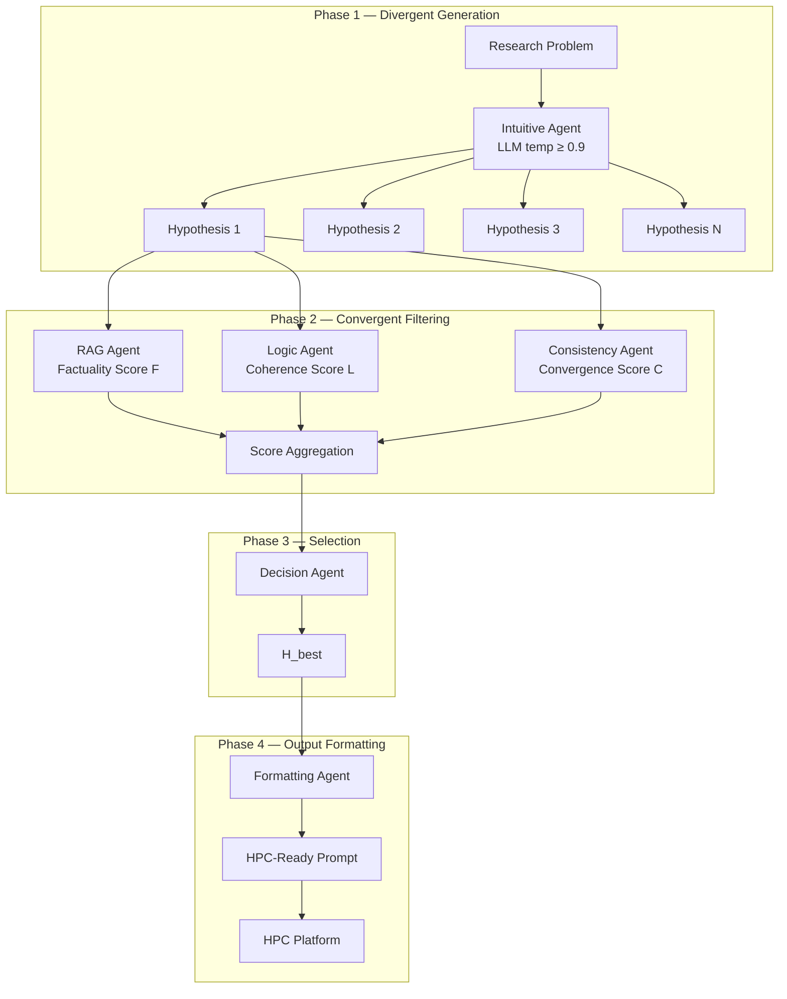
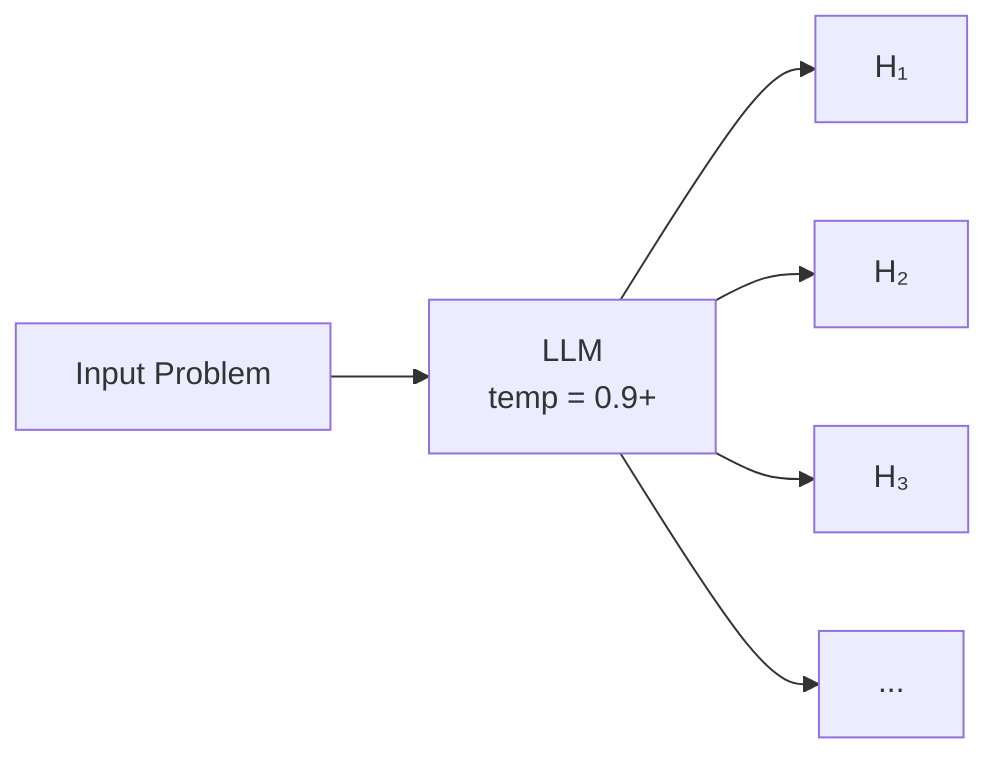
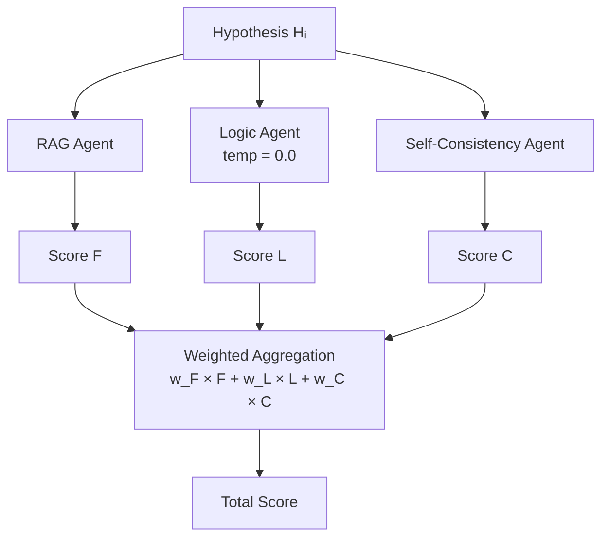
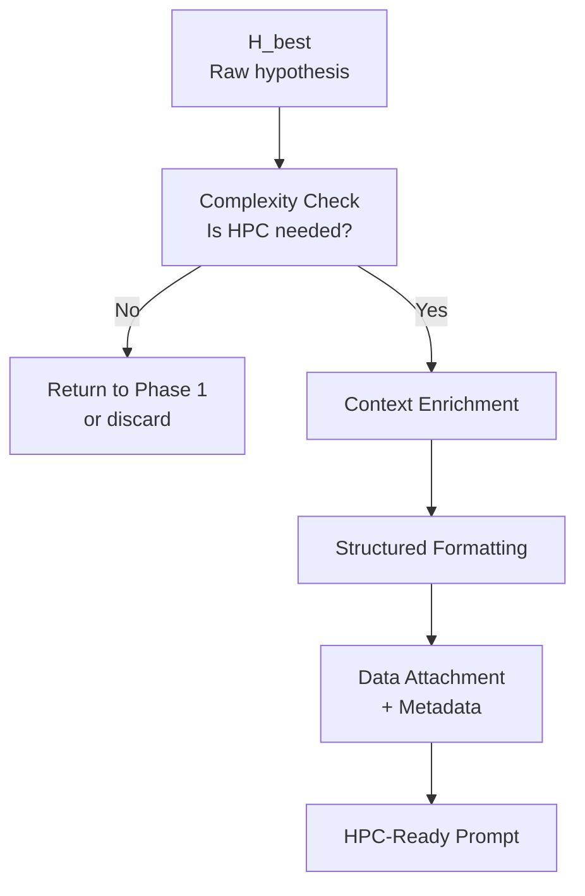
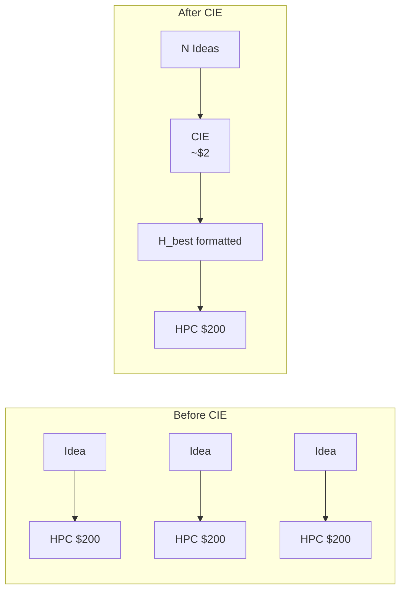

# Controlled Intuition Engine (CIE)

> Agentic Hypothesis Pre-Layer for HPC Platforms

Repo type: **ideas-draft**  
Status: **conceptual + architectural proposal**

---

## TL;DR

The Controlled Intuition Engine (CIE) is a multi-agent system designed to optimize costly scientific discovery processes. It solves the bottleneck between fast ideation (low cost) and expensive validation (HPC/Simulation).

CIE exploits the **non-rational generation phase** (hallucination) of LLMs to simulate subconscious pattern matching and generate highly divergent hypotheses, which are then subjected to rigorous rational filtering before being sent to compute-intensive engines.

‘Intuition’ here refers to controlled stochastic pattern sampling in large language models, not to human-like insight or cognition.

---

## Value Proposition

| Before (Linear Process) | After (With CIE) |
|-------------------------|------------------|
| Generation: Manual, limited to explicit reasoning (CoT) | Generation: Divergent, non-rational (Intuitive Agent) |
| Cost: Each hypothesis tested via expensive HPC run ($200 / 48h) | Efficiency: Only the filtered hypothesis H_best is sent to HPC |
| Result: Risk of spending on non-viable hypotheses | Result: Reduced HPC cycle waste, accelerated breakthrough discoveries |

### ROI Formula

```
                    Hypothesis Success Rate × Simulation Cost
Global Efficiency = ——————————————————————————————————————————
                         Intuitive Generation Cost
```

CIE maximizes the numerator and minimizes the denominator.

---

## Conceptual Framework



---

## Phase 1 — Divergent Generation

**Objective**: Create divergence and non-obvious connections.

| Agent | Role | Configuration | Output |
|-------|------|---------------|--------|
| Intuitive Agent | Generate divergent hypotheses | LLM with high temperature (≥ 0.9). Instruction to suppress explicit reasoning | N raw hypotheses (H₁, ..., Hₙ) |



The model is explicitly instructed to **not reason step-by-step** — to generate based on pattern matching, not logical deduction.

---

## Phase 2 — Convergent Filtering (The Guardrail)

Each hypothesis (Hᵢ) is scored in parallel by verification agents to determine viability.

| Agent | Function | Score | Specialty |
|-------|----------|-------|-----------|
| RAG Agent | Search for support/contradiction in scientific literature | Factuality (F) | Novelty and factual relevance verification |
| Logic Agent | Verify absence of internal contradiction in Hᵢ premises | Logic (L) | Pure explicit reasoning (LLM temp = 0.0) |
| Self-Consistency Agent | Compare Hᵢ to other generated hypotheses | Convergence (C) | Detect emergent or isolated patterns |



### Weight Calibration by Domain

| Domain | Factuality (w_F) | Logic (w_L) | Convergence (w_C) |
|--------|------------------|-------------|-------------------|
| Physics | Medium | High | Low |
| Chemistry | High | Medium | Medium |
| Biology | High | Medium | High |

---

## Phase 3 — Selection

The Decision Agent compiles scores (F, L, C) into a weighted Total Score and selects H_best.


**Epistemic Constraint**: The output does not contain the LLM's explicit reasoning to maintain the integrity of the simulated intuition.

---

## Phase 4 — Output Formatting (Prompt Engineering for HPC)

**Objective**: Transform H_best into an optimized prompt for the downstream HPC/Research Agent.

Raw hypotheses are not directly usable by HPC platforms. A **Formatting Agent** restructures H_best according to best practices for research agents.

### Formatting Principles

These guidelines are derived from documented best practices of HPC platforms (e.g. Kosmos by Edinson Scientific) and are generalizable to any data-driven discovery agent.

| Principle | Description | Transformation |
|-----------|-------------|----------------|
| **Clear, iterable objective** | The research question should require iteration, not be answerable by a single lookup | Reformulate H_best as an open research question |
| **Sufficient context** | Provide scientific and experimental background as a starting point | Inject domain context, key assumptions, relevant prior work |
| **Non-trivial scope** | Avoid questions answerable by reading a few papers or one analysis | Verify H_best requires actual computation/simulation |
| **Data description** | Ensure all provided data is interpretable without clarification | Attach metadata, column descriptions, preprocessing notes |
| **Actionable framing** | Phrase as you would explain to an experienced colleague | Use precise scientific language, explicit success criteria |

### Formatting Flow



### Example Transformation

**Before (raw H_best)**:
```
X protein might regulate Y pathway through Z mechanism
```

**After (formatted for HPC)**:
```
Research Objective: Investigate whether protein X influences 
pathway Y through mechanism Z.

Context: Recent literature suggests X is upregulated in [condition]. 
Our preliminary analysis indicates correlation with Y markers. 
The Z mechanism has been observed in similar systems [ref].

Data provided: RNA-seq dataset (see attached metadata).
Column 'expr_X' = normalized expression of protein X.

Expected output: Identify regulatory relationships, propose 
follow-up experiments to validate the Z mechanism hypothesis.
```

### Why This Matters

| Without Formatting | With Formatting |
|--------------------|-----------------|
| Vague hypothesis sent to HPC | Structured research objective |
| HPC wastes cycles on interpretation | HPC focuses on computation |
| Results may be misaligned with intent | Results directly address hypothesis |
| Multiple iterations needed | First-pass success rate increases |

---

## Technical Stack

| Component | Technology | Role in CIE |
|-----------|------------|-------------|
| Agent Orchestration | LangGraph / Autogen | Manages loops and information flow between N agents |
| Intuitive Agent | LLM (e.g. Llama 3, Claude) | Divergent generation |
| RAG Agent | RAG Platform + Vector DB (pgvector / Chroma) | Factual filtering |
| Logic Agents | LLM at zero temperature | Internal coherence verification |
| Formatting Agent | LLM + Domain Templates | Prompt engineering for HPC |
| HPC Interface | Python API Gateway | Submission to HPC platform |

---

## Strategic Integration with HPC

CIE is an **upstream optimization plug-in** for HPC platforms. It transforms expensive HPC runs into final validation steps instead of random iteration stages.



**Cost comparison** (example):
- Before: 10 hypotheses × $200 = $2,000
- After: 10 hypotheses → CIE ($2) → 1 H_best → $200 = $202

---

## R&D Questions (Challenges & Future Directions)

1. **Calibration**: How to calibrate the Intuitive Agent's temperature to maximize originality (C↓) without degrading factuality (F↑)?

2. **Measuring Intuition**: How to prove that H_best is the result of "intuition" and not just lucky sampling? (Test: Compare H_best to the answer obtained via classical CoT)

3. **Score Weighting**: Optimization of weights (w_F, w_L, w_C) based on scientific domain.

4. **Feedback Loop**: Can HPC results be used to fine-tune the filtering agents over time?

5. **Formatting Templates**: Domain-specific prompt templates for different HPC platforms and research fields.

---

## Relationship to Existing Work

| Approach | Similarity | Difference |
|----------|------------|------------|
| Tree of Thoughts | Multiple hypothesis exploration | ToT uses explicit reasoning; CIE uses non-rational generation |
| Self-Consistency | Multiple sampling + majority vote | CIE uses structured multi-agent filtering, not just voting |
| Constitutional AI | Post-generation filtering | CIE filtering is domain-specific and score-based |

**Key distinction**: CIE explicitly assumes the generation phase is **non-rational by design**.

---

## References

- Formatting guidelines adapted from [Kosmos Best Practices](https://www.edisonscientific.com/) (Edinson Scientific)
- Multi-agent orchestration patterns: LangGraph documentation
- Hallucination-as-feature concept: internal research exploration

---

## Status

This repository is an ideas draft:
- exploratory
- non-production
- open to iteration

*Its purpose is to structure thinking about optimizing the ideation-to-validation pipeline in scientific discovery.*
