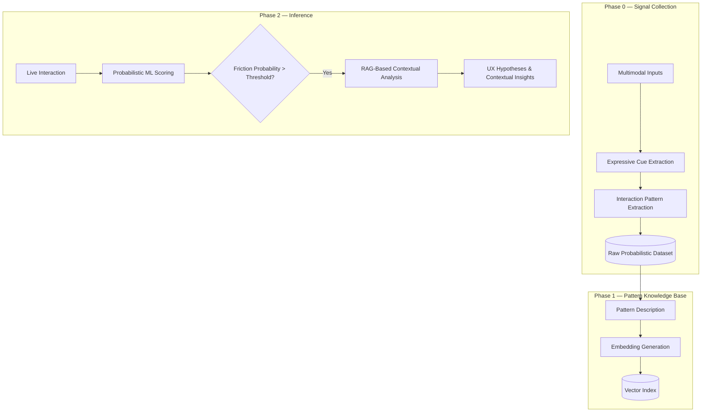
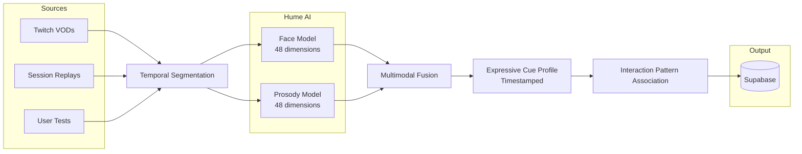
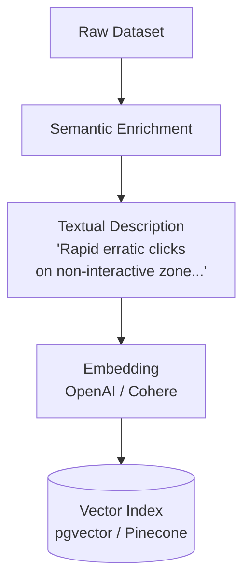
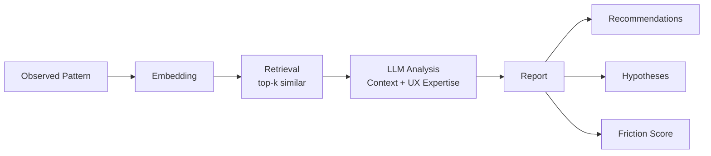
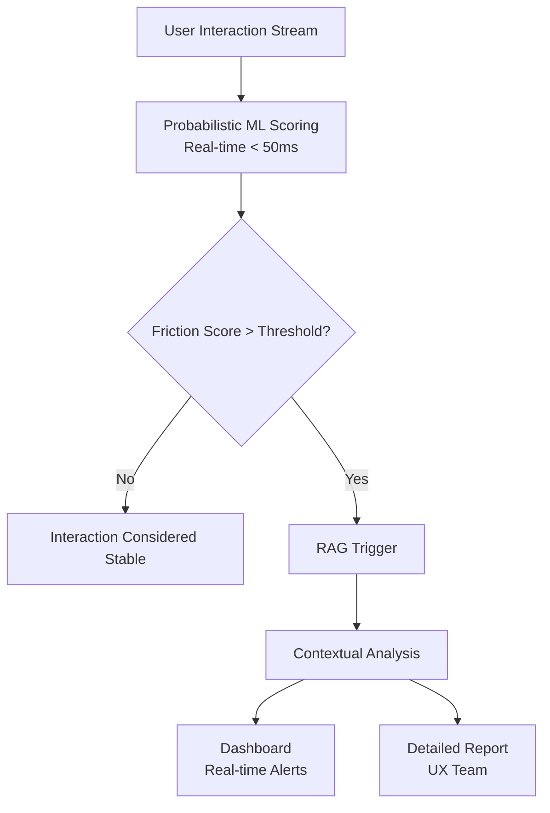

# Probabilistic Multimodal UX Friction Analysis

> Exploratory framework for estimating **probabilistic UX friction** from multimodal expressive cues and interaction patterns.

Repo type: **ideas-draft**  
Status: **conceptual + early prototyping**

---

## TL;DR

This project explores how **UX friction** can be *estimated probabilistically* by combining:

- expressive cues (face, voice prosody),
- interaction patterns (mouse, keyboard, navigation),
- contextual task information.

The system **does not infer emotions or internal mental states**.  
It estimates the **likelihood of interactional breakdowns**, and generates **plausible UX hypotheses** to assist human analysis.

This is not a product, not a detector, not a diagnostic system.  
It is an **instrumented way to think about friction**.

---

## Motivation

Traditional UX analytics (funnels, heatmaps, session replays) describe **what happens**, but struggle to explain **when an interaction becomes costly, confusing, or fragile**.

UX friction is often:
- gradual,
- context-dependent,
- expressed indirectly through behavior.

The hypothesis here is that **converging observable signals** can indicate *when something is likely going wrong*, even if the precise cause remains uncertain.

---

## Conceptual Framing (important)

- Observable affect ≠ subjective emotion  
- Expressive signals ≠ intention  
- Correlation ≠ causation  

This system:
- works with **proxies**, not truths,
- outputs **probabilities**, not labels,
- generates **hypotheses**, not diagnoses,
- keeps the **human in the loop**.

---

## High-Level Architecture



---

## Phase 0 — Data Collection Pipeline

**Objective**: Collect observable signals that may correlate with UX friction, without assuming ground truth.

### Data Sources

**Exploratory / weak supervision**
- Public video streams (Twitch, YouTube)
- Used for:
  - expressive space exploration
  - representation learning
  - multimodal alignment
- Not used as UX ground truth

**More conventional UX sources**
- Instrumented user tests
- Session replays (Hotjar / FullStory-like)
- Front-end logs (errors, retries, latency)
- Contextual micro-surveys (Likert scale)

### Expressive Cues (Affective Signals)

These dimensions are treated as expressive signal spaces, not validated measures of subjective emotional experience.

- Facial activity vectors (e.g. 48-dim continuous space)
- Vocal prosody (pitch, energy, rhythm, variability)
- Time-aligned with interaction events

These cues indicate expressive likelihoods, not inner experience.

### Interaction Patterns

| Channel | Examples |
|---------|----------|
| Mouse | Velocity spikes, jitter, rage clicks |
| Keyboard | Burst typing, corrections, pauses |
| Scroll | Oscillation without reading |
| Navigation | Backtracking, abandonment |

*These signals are often more UX-relevant than expressive cues alone.*



### Extracted Gesture Features

| Category | Features |
|----------|----------|
| Mouse | Velocity, trajectory, click frequency, erratic patterns |
| Keyboard | Keystroke intervals, keydown duration, corrections, rage typing |
| Screen | Focus zones, scroll patterns, time per section |

---

## Phase 1 — Pattern Knowledge Base

**Objective**: Build a memory of observed cases, not a truth table.

Each pattern stores:
- contextual description,
- associated signals,
- plausible UX hypotheses,
- confidence level.



### Embedded Document Structure

```json
{
  "pattern_id": "ux_case_014",
  "description": "Repeated interactions on a visually salient but non-responsive element",
  "signals": {
    "expressive_cues": {
      "frustration_like": 0.78,
      "confusion_like": 0.51
    },
    "interaction_patterns": {
      "click_frequency": "high",
      "cursor_variability": "erratic"
    }
  },
  "context": {
    "task": "form submission",
    "ui_state": "no feedback"
  },
  "ux_hypotheses": [
    "Missing action feedback",
    "Ambiguous affordance",
    "Perceived latency"
  ],
  "confidence": 0.69
}
```

---

## Phase 2 — Probabilistic Inference

### ML Scoring

- Lightweight, interpretable models (e.g. XGBoost)
- Output: P(friction | signals)
- Used for:
  - triage
  - prioritization
  - triggering deeper analysis

### Contextual Reasoning (RAG)

Triggered only when probability exceeds a threshold.

RAG is used to:
- retrieve similar historical cases,
- surface context,
- generate UX hypotheses, not explanations.



### Example Output

```
Estimated friction probability: 0.82

Similar observed cases:
- Repeated clicks on non-reactive UI
- Increased interaction velocity

Plausible UX hypotheses:
1. Insufficient feedback after action
2. Latency above perceptual threshold
3. Ambiguous clickable area
```

---

## Phase 3 — Production System (Roadmap)

**Objective**: Hybrid real-time system combining probabilistic ML scoring and RAG-based contextual analysis.



### Why Hybrid ML + RAG?

| Component | Role | Latency | Cost |
|-----------|------|---------|------|
| ML | Real-time probabilistic scoring | < 50ms | Low |
| RAG | Contextual hypothesis generation | 1-3s | Token-based |

ML performs probabilistic triage; RAG supports contextual hypothesis generation only when needed.

This separation:
- keeps latency low for continuous monitoring,
- limits LLM usage to high-risk situations,
- avoids over-interpretation in low-signal contexts.

---

## Technical Stack

| Component | Technology | Rationale |
|-----------|------------|-----------|
| Orchestration | LangGraph | State management, checkpoints |
| Embeddings | OpenAI text-embedding-3-small | Good semantic quality with controlled cost |
| Vector DB | pgvector (Supabase) | Tight integration, cost-efficient |
| Expressive Signal API | Hume AI | 48-dimensional continuous expressive space, cross-cultural validation |
| ML Scoring | XGBoost | Lightweight, interpretable, production-friendly |

---

## Human-in-the-Loop Analysis

**Objective**: Ensure that interpretation and decision-making remain human.

Possible interfaces:
- Dashboards
- Annotated session views
- Alerting on high-risk interactions

Primary users:
- UX researchers
- Product designers
- Support / QA teams

---

## Evaluation Strategy

### Quantitative

- ROC / AUC
- Precision–Recall (recall prioritized)
- Correlation with user feedback

### Qualitative

- UX expert review
- False positive / false negative analysis
- Threshold calibration

---

## Limitations (explicit)

- No inference of internal emotional states
- Context-dependent validity
- Cultural and expressive biases
- Requires calibration per product

**This system estimates interactional risk, not intent, emotion, or cognition.**

---

## Scientific Foundations

### Semantic Space Theory

> Emotion is not 6 discrete categories (Ekman) but a continuous space of 20-28 dimensions.

— Keltner, Cowen et al. (2022)

Cross-culturally validated across 144 countries, 6M videos. Theoretical basis for Hume AI models.

### References

- [Semantic Space Theory (2022)](https://doi.org/10.1177/09637214221150511)
- [Emotion Expression Estimates (2023)](https://doi.org/10.1145/3610661.3616129)
- [MuSe Challenge 2023](https://doi.org/10.1145/3581783.3610943)

---

## Status

This repository is an ideas draft:
- exploratory
- non-production
- open to iteration

*Its purpose is to structure thinking, not to ship a solution.*
