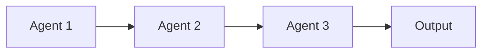
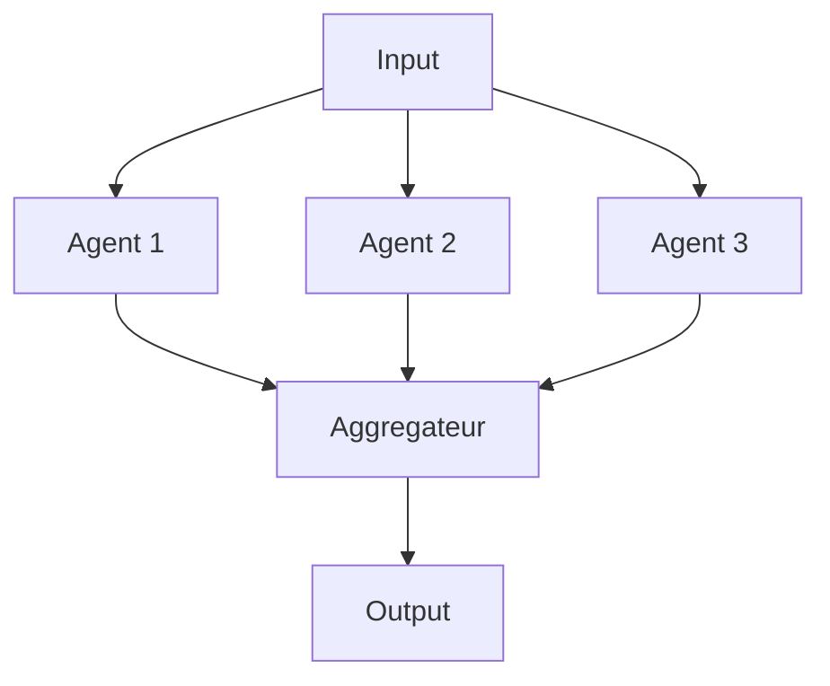
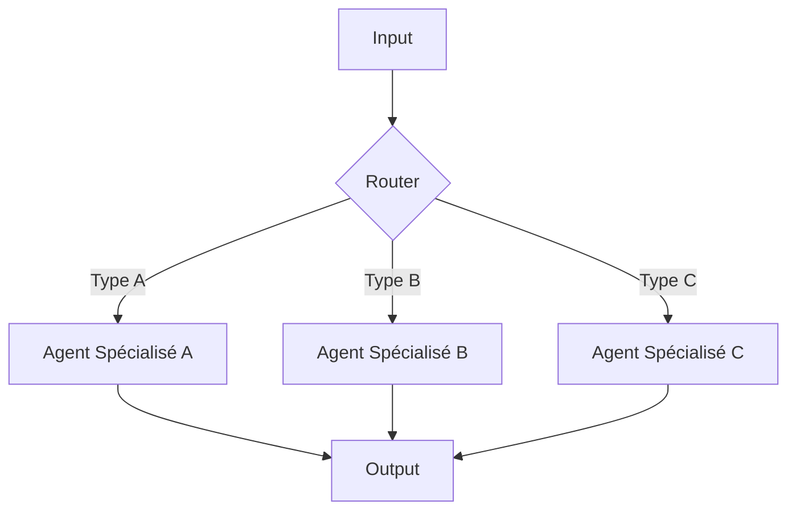
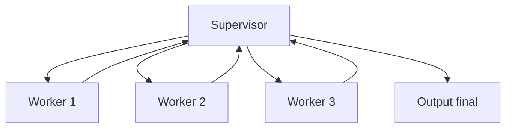
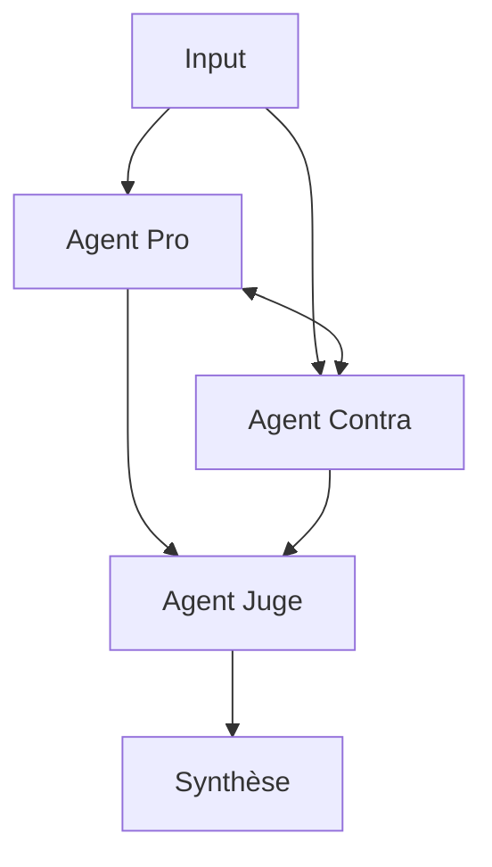
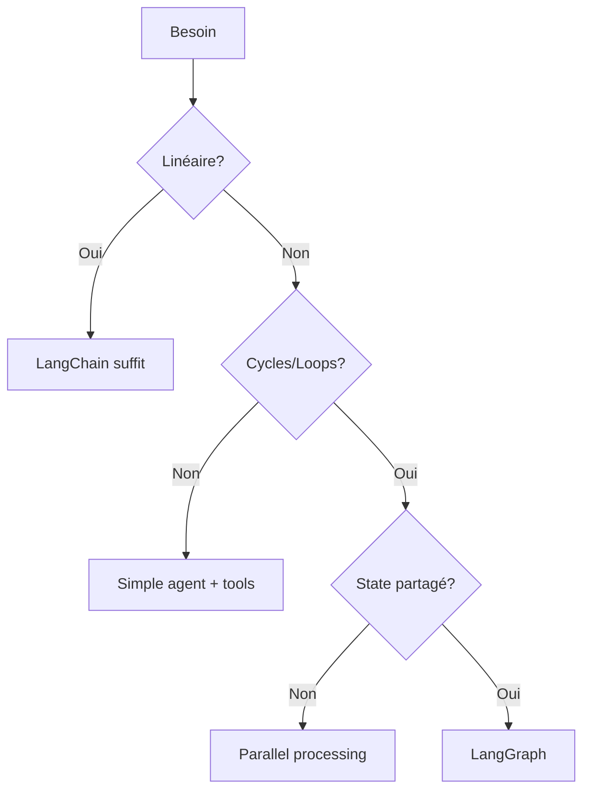

# 🤖 Patterns Multi-Agents

Notes sur les architectures multi-agents et leur application.

---

## Vocabulaire

| Terme | Définition |
|-------|------------|
| **Agent** | LLM + outils + instructions spécialisées |
| **Orchestrateur** | Agent qui coordonne les autres |
| **State** | Données partagées entre agents |
| **Checkpoint** | Sauvegarde d'état pour reprise |

---

## Patterns courants

### 1. Sequential (Pipeline)

**Use case** : Tâches linéaires où chaque étape dépend de la précédente.

### 2. Parallel (Fan-out / Fan-in)

**Use case** : Tâches indépendantes qui peuvent être parallélisées.

### 3. Router (Conditional)

**Use case** : Requêtes de nature différente nécessitant des expertises différentes.

### 4. Hierarchical (Supervisor)

**Use case** : Tâches complexes nécessitant coordination et validation.

### 5. Debate (Adversarial)

**Use case** : Décisions nécessitant des perspectives opposées.

---

## LangGraph vs LangChain

| Aspect | LangChain | LangGraph |
|--------|-----------|-----------|
| Paradigme | Chains linéaires | Graphs avec cycles |
| State | Limité | First-class citizen |
| Checkpoints | Non natif | Natif |
| Conditional logic | Callbacks | Edges conditionnels |
| Use case | Simple workflows | Complex multi-agent |

---

## Quand utiliser quoi ?

---

## Notes perso

- Commencer simple (single agent) puis complexifier si besoin
- Le multi-agent ajoute de la latence et du coût
- Le state management est le vrai challenge
- Les checkpoints sont essentiels pour debug et reprise

---

*En cours d'enrichissement*
